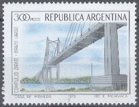

# Filatelia

## Ejercicio integrador

**La asociación de coleccionistas de estampillas "Nueve reinas" de Campana nos convoca a hacer un sistema para organizar las búsquedas de sus socios, ayudar a cotizar su valor y detectar estampillas "falladas", que son las que más valen.**

Para empezar, conozcamos algo más sobre el mundo de la filatelia, más concretamente la visión que tiene la asociación sobre dicho actividad. 

### Las estampillas

De cada estampilla se conoce su valor "facial" (el que está impreso), el año de emisión y el país de origen.

_Esta es de Argentina, su valor facial es de 300 pesos y fue emitida en 1979_
.

_Esta es de Japón, vale también 300 y es del año 1974_

### Características destacadas
Hay también algunas otras diferencias que son de interés.

- Algunas estampillas son ordinarias y otras son conmemorativas. De estas últimas se registra una descripcion del motivo que conmemoran. Por ejemplo, la de Japón es ordinaria, en cambio la de Argentina es conmemorativa y tiene por motivo "Complejo Zarate - Brazo Largo".
- Las estampillas que tienen más de 100 años se consideran antiguas, las otras son modernas. Todos los años se siguen emitiendo nuevas estampillas, obviamente modernas, pero también algunas que eran modernas y estaban al límite, pasan a considerarse antiguas.
- Una estampilla se considera fallada cuando tiene una fecha de emisión en la que el país de emisión no existía. Por ejemplo, Yugoslavia existió desde 1918 hasta 1991; si hay una estampilla de yugoslavia del año 1992, se considera fallada.

### Cotizaciones

La cotización de cada estampilla se calcula de la siguiente manera:
Es su valor facial multiplicado por un coeficiente que depende del país y en el caso de ser conmemorativa es el doble (o el triple si en la descripción incluye las palabras "Zarate" o "Campana"). A lo anterior, se le suma un incremento por antiguedad: se le suman 5 unidades por cada año que supera la antigua mínima para ser considerada antigua, pero sin que el incremento supere 150, por lo que si la estampilla no es antigua, no tiene incremento. 
*Pero cuidado:* Si es una estampilla fallada, su cotización es de 1000000, independientemente de todo lo dicho anteriormente.

Por ejemplo: 
- La estampilla de Argentina sale 900 (300 * 3 * 1, ya que es conmemorativa y dice "zarate", asumiendo que el coeficiente de argentina es 1, sin incremento de antigüedad)
- La de Japón sale 3000 (suponiendo que el coeficiente de japón es 10, como es ordinaria, es 300 * 10, sin incremento de antigüedad) 
- Si la estampilla de japón fuera del año 1918, saldría 3010 (300 * 10 más el incremento de antigüedad correspondiente a dos años 5*2)
- Y si fuera del año 1880, su cotizacion ascendería a 3150 (300 * 10, más un incremento de antiguedad de 150, por mas que sean 40 los años de diferencia)
- Pero si japón se hubiera fundado luego de 1880, dicha estampilla valdría 1000000 sin hacer ninguna cuenta.

### Requerimientos

**Se requiere poder hacer:**
1. Descubrir si una estampilla está fallada.
2. Saber si una estampilla es común, lo cual sucede si la tienen más de 10 miembros de la sociedad. 
3. Averiguar cuál es el integrante de la asociación que tiene la colección de mayor cotización total.
4. Calcular la cantidad de estampillas que tiene un socio, de un país dado. 
5. Dada una estampilla, saber si le interesa a uno de los socios. Para ello, cada persona debe saber previamente cuáles son los países que busca, es decir que sean de su interés. La estampilla le va a interesar si es de alguno de esos países, y obviamente, siempre y cuando no la tenga ya en su propia colección.
6. Simular el paso del tiempo, en una determinada cantidad de años, y garantizar que todo siga funcionando.
7. Se agregan nuevo material filatélico, las "Hojitas block". Se considera todo como una unidad, pero a la vez contiene varias estampillas. Cada una de ellas tiene un valor facial, por lo que el valor facial de la hojita es la sumatoria del valores faciales de las estampillas que la componen. En general, el país y el año de emisión de la hojita coincide con los de sus componentes, pero en caso que no lo haga significa que está fallada. Para su cotización se consideran conmemorativas.

_Hojita block de Rusia, 1989, con valor facial de 115. (Esta formada por 6 estampillas de diferente valor facial cada una, todas de Rusia del mismo año) Su cotización es de  690 (115 * 3 * 2, asumiendo que rusia tiene un coeficiente 3, el doble por ser conmemorativa y sin adicional de antigüedad)_

  -  Implementarlo para que todo siga funcionando. ¿Que conceptos facilitan esta incorporación?
  -  En caso que pueda haber gente que tenga suelta alguna de las estampillas que forma parte de una hojita block, o que haya dos hojitas block diferentes que contienen la misma estampilla. ¿En qué puede afectar a la determinación de si una estampilla es común? 
  -  ¿Qué alternativas de solución hay, en caso que la cantidad de estampillas de una persona, en el caso de una hojita block se cuenta como una o como la cantidad de estampillas que contiene? (Por ejemplo, si alguien tiene la de argentina y la hojita de Rusia, ¿tiene 2 o 7 estampillas?) Hacer el código de una de las alternativas y comentar cómo sería la otra) 

8. Hacer al menos un test.
